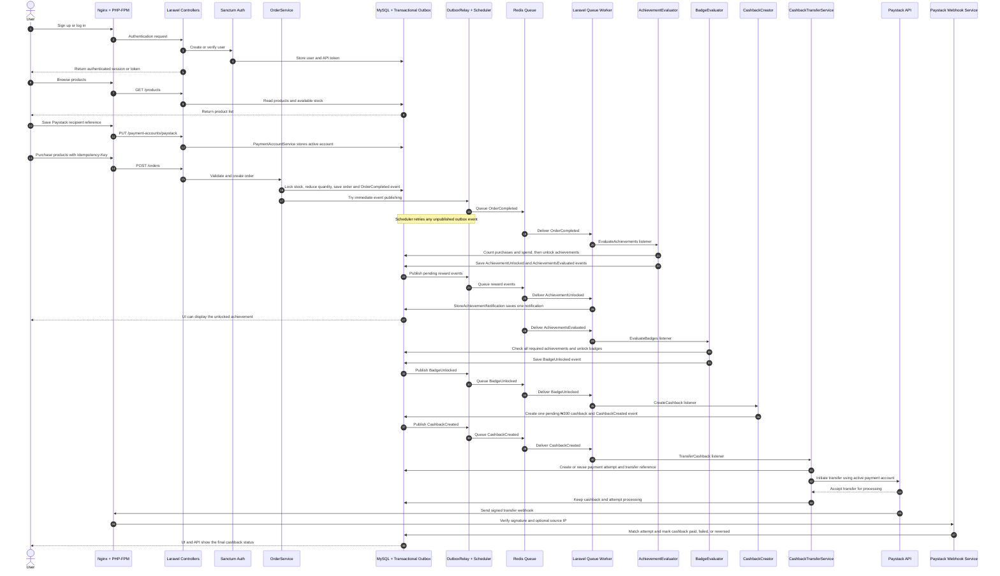

# Architecture and user journey

This diagram follows a user from authentication and shopping through achievement, badge, cashback, and payment confirmation.

The outbox, database constraints, idempotent listeners, and reusable Paystack transfer reference make the flow safe to retry without creating duplicate rewards or payments.
